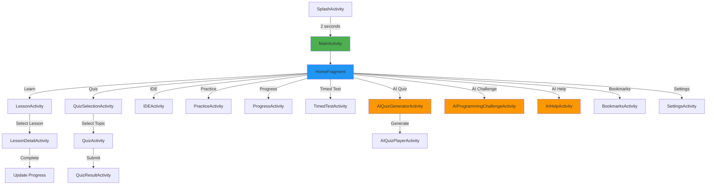
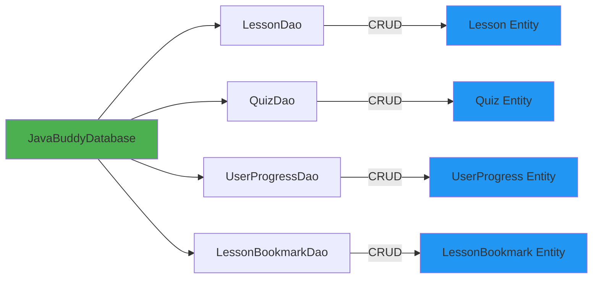
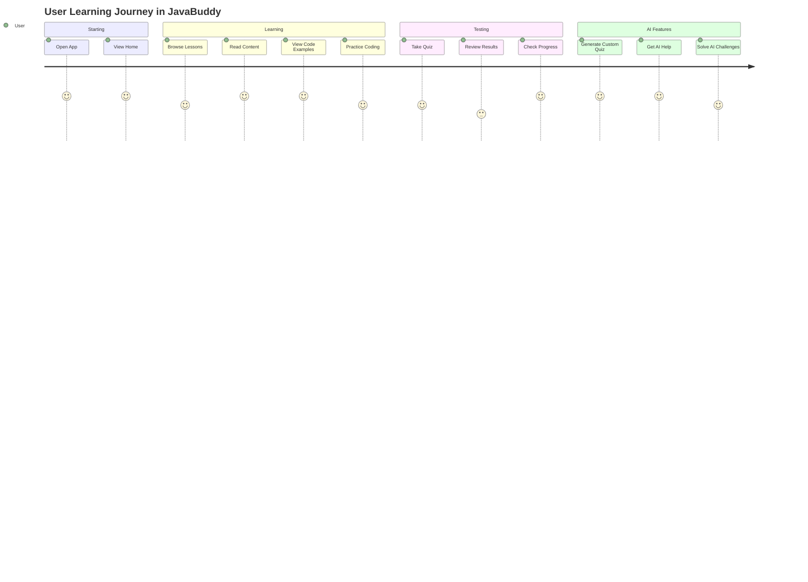

# JavaBuddy Application - Framework Flowchart

## Table of Contents
1. [Application Architecture Overview](#application-architecture-overview)
2. [Navigation Flow](#navigation-flow)
3. [Component Diagram](#component-diagram)
4. [Data Flow](#data-flow)
5. [Mermaid Flowchart Code](#mermaid-flowchart-code)
6. [Tools for Creating Visual Flowcharts](#tools-for-creating-visual-flowcharts)

---

## Application Architecture Overview

```
┌─────────────────────────────────────────────────────────────┐
│                      JavaBuddy App                          │
├─────────────────────────────────────────────────────────────┤
│                                                             │
│  ┌──────────────┐    ┌──────────────┐    ┌──────────────┐ │
│  │ Presentation │    │   Business   │    │     Data     │ │
│  │    Layer     │◄──►│     Logic    │◄──►│    Layer     │ │
│  └──────────────┘    └──────────────┘    └──────────────┘ │
│         │                    │                    │        │
│    Activities           Adapters            Database       │
│    Fragments            AI Service          Room DB        │
│    XML Layouts          Utils               DAOs           │
│                                             Entities       │
└─────────────────────────────────────────────────────────────┘
```

---

## Navigation Flow

### Main Navigation Structure

```
                    ┌─────────────────┐
                    │  SplashActivity │
                    └────────┬────────┘
                             │
                             ▼
                    ┌─────────────────┐
                    │  MainActivity   │
                    │  (HomeFragment) │
                    └────────┬────────┘
                             │
        ┌────────────────────┼────────────────────┐
        │                    │                    │
        ▼                    ▼                    ▼
┌──────────────┐    ┌──────────────┐    ┌──────────────┐
│   Learning   │    │   Practice   │    │  AI Tools    │
│   Section    │    │   Section    │    │   Section    │
└──────────────┘    └──────────────┘    └──────────────┘
```

### Detailed Navigation Flow

```
MainActivity (Home)
│
├─► LessonActivity
│   └─► LessonDetailActivity
│       ├─► Content Tab
│       ├─► Code Example Tab
│       └─► Practice Tab
│
├─► QuizSelectionActivity
│   └─► QuizActivity
│       └─► QuizResultActivity
│
├─► IDEActivity
│   (Compile & Run Java Code)
│
├─► PracticeActivity
│   └─► ProblemSolvingActivity
│
├─► ProgressActivity
│   (View Stats & Achievements)
│
├─► TimedTestActivity
│   (Timed Quiz Challenge)
│
├─► AIQuizGeneratorActivity
│   └─► AIQuizPlayerActivity
│       (Play Generated Quiz)
│
├─► AIProgrammingChallengeActivity
│   (Generate Coding Challenges)
│
├─► AIHelpActivity
│   (Ask Questions to AI)
│
├─► BookmarksActivity
│   (View Saved Lessons)
│
└─► SettingsActivity
    (App Configuration)
```

---

## Component Diagram

### High-Level Components

```
┌─────────────────────────────────────────────────────────────┐
│                         UI Layer                            │
├─────────────────────────────────────────────────────────────┤
│                                                             │
│  ┌──────────────────────────────────────────────────────┐  │
│  │              Activities (19)                         │  │
│  │  - MainActivity (Entry Point)                        │  │
│  │  - LessonActivity, QuizActivity                      │  │
│  │  - AI-Powered Activities (Quiz, Challenge, Help)    │  │
│  │  - Progress, Settings, Bookmarks                     │  │
│  └──────────────────────────────────────────────────────┘  │
│                                                             │
│  ┌──────────────────────────────────────────────────────┐  │
│  │              Fragments (4)                           │  │
│  │  - HomeFragment (Main Screen)                        │  │
│  │  - SettingsFragment                                  │  │
│  │  - Lesson Content Fragments                          │  │
│  └──────────────────────────────────────────────────────┘  │
│                                                             │
└─────────────────────────────────────────────────────────────┘
                              │
                              ▼
┌─────────────────────────────────────────────────────────────┐
│                      Adapter Layer                          │
├─────────────────────────────────────────────────────────────┤
│  - LessonAdapter (Display lesson cards with Lottie)        │
│  - QuizTopicAdapter (Display quiz topics)                  │
│  - LessonDetailPagerAdapter (Manage lesson tabs)           │
│  - Other RecyclerView Adapters                             │
└─────────────────────────────────────────────────────────────┘
                              │
                              ▼
┌─────────────────────────────────────────────────────────────┐
│                     Business Logic                          │
├─────────────────────────────────────────────────────────────┤
│  ┌──────────────────────────────────────────────────────┐  │
│  │         AI Service (Groq API)                        │  │
│  │  - GroqApiService                                    │  │
│  │  - Generate Quizzes                                  │  │
│  │  - Generate Challenges                               │  │
│  │  - Answer Questions                                  │  │
│  └──────────────────────────────────────────────────────┘  │
│                                                             │
│  ┌──────────────────────────────────────────────────────┐  │
│  │         Database Populator                           │  │
│  │  - Pre-populate lessons & quizzes                    │  │
│  └──────────────────────────────────────────────────────┘  │
│                                                             │
│  ┌──────────────────────────────────────────────────────┐  │
│  │         UI Utilities                                 │  │
│  │  - AnimationPalette (Lottie management)              │  │
│  └──────────────────────────────────────────────────────┘  │
└─────────────────────────────────────────────────────────────┘
                              │
                              ▼
┌─────────────────────────────────────────────────────────────┐
│                      Data Layer                             │
├─────────────────────────────────────────────────────────────┤
│  ┌──────────────────────────────────────────────────────┐  │
│  │         Room Database                                │  │
│  │  - JavaBuddyDatabase                                 │  │
│  └──────────────────────────────────────────────────────┘  │
│                                                             │
│  ┌──────────────────────────────────────────────────────┐  │
│  │         Entities (6)                                 │  │
│  │  - Lesson                                            │  │
│  │  - Quiz                                              │  │
│  │  - UserProgress                                      │  │
│  │  - LessonBookmark                                    │  │
│  └──────────────────────────────────────────────────────┘  │
│                                                             │
│  ┌──────────────────────────────────────────────────────┐  │
│  │         DAOs (Data Access Objects)                   │  │
│  │  - LessonDao                                         │  │
│  │  - QuizDao                                           │  │
│  │  - UserProgressDao                                   │  │
│  │  - LessonBookmarkDao                                 │  │
│  └──────────────────────────────────────────────────────┘  │
│                                                             │
│  ┌──────────────────────────────────────────────────────┐  │
│  │         SharedPreferences                            │  │
│  │  - Settings storage                                  │  │
│  │  - Animation preferences                             │  │
│  └──────────────────────────────────────────────────────┘  │
└─────────────────────────────────────────────────────────────┘
```

---

## Data Flow

### User Learning Flow

```
┌──────────┐
│   User   │
└────┬─────┘
     │
     ▼
┌─────────────────┐
│  Home Screen    │
│  (Select Topic) │
└────┬────────────┘
     │
     ▼
┌─────────────────┐       ┌──────────────┐
│ Lesson List     │◄──────┤ Room DB      │
│ (15 Lessons)    │       │ (Load Data)  │
└────┬────────────┘       └──────────────┘
     │
     ▼
┌─────────────────┐
│ Lesson Detail   │
│ - Content       │
│ - Code Example  │
│ - Practice      │
└────┬────────────┘
     │
     ▼
┌─────────────────┐       ┌──────────────┐
│ Mark Complete   │──────►│ Update DB    │
└─────────────────┘       │ UserProgress │
                          └──────────────┘
```

### Quiz Flow

```
┌──────────┐
│   User   │
└────┬─────┘
     │
     ▼
┌─────────────────┐       ┌──────────────┐
│ Quiz Selection  │◄──────┤ Room DB      │
│ (By Lesson)     │       │ (Load Quiz)  │
└────┬────────────┘       └──────────────┘
     │
     ▼
┌─────────────────┐
│ Take Quiz       │
│ (MCQ Questions) │
└────┬────────────┘
     │
     ▼
┌─────────────────┐
│ Calculate Score │
└────┬────────────┘
     │
     ▼
┌─────────────────┐       ┌──────────────┐
│ Show Results    │──────►│ Save Score   │
└─────────────────┘       │ to Database  │
                          └──────────────┘
```

### AI Integration Flow

```
┌──────────┐
│   User   │
│ (Request)│
└────┬─────┘
     │
     ▼
┌─────────────────┐
│ AI Activity     │
│ (Quiz/Challenge │
│  /Help)         │
└────┬────────────┘
     │
     ▼
┌─────────────────┐       ┌──────────────┐
│ GroqApiService  │──────►│ Groq API     │
│ (Send Prompt)   │       │ (Cloud)      │
└────┬────────────┘       └──────┬───────┘
     │                            │
     │◄───────────────────────────┘
     │ (Response)
     ▼
┌─────────────────┐
│ Parse Response  │
│ (JSON/Text)     │
└────┬────────────┘
     │
     ▼
┌─────────────────┐
│ Display to User │
│ or Save to File │
└─────────────────┘
```

---

## Mermaid Flowchart Code

You can use this code in tools that support Mermaid diagrams (like GitHub, draw.io, or online Mermaid editors):

### Overall Application Flow



### Database Schema Flow



### User Journey Map



---

## Tools for Creating Visual Flowcharts

### 1. **Online Tools (Recommended)**

#### A. **Draw.io (diagrams.net)** - FREE
- URL: https://app.diagrams.net/
- **Best for**: Professional flowcharts
- **Features**: 
  - Android app wireframes
  - UML diagrams
  - Export to PNG, SVG, PDF
  - No registration required

**Steps:**
1. Go to draw.io
2. Choose "Blank Diagram"
3. Use shapes from left panel:
   - Rectangles for Activities
   - Diamonds for Decisions
   - Arrows for Flow
4. Use Android mockup templates

#### B. **Mermaid Live Editor** - FREE
- URL: https://mermaid.live/
- **Best for**: Quick diagrams from code
- **Features**:
  - Copy the Mermaid code above
  - Auto-generates visual diagrams
  - Export to SVG, PNG

#### C. **Lucidchart** - FREE (Limited)
- URL: https://www.lucidchart.com/
- **Best for**: Collaborative diagrams
- **Features**:
  - Templates for app flowcharts
  - Real-time collaboration
  - Professional export options

#### D. **Whimsical** - FREE (Limited)
- URL: https://whimsical.com/
- **Best for**: Modern, clean diagrams
- **Features**:
  - Flowcharts, wireframes
  - Mindmaps
  - Beautiful design

#### E. **Excalidraw** - FREE
- URL: https://excalidraw.com/
- **Best for**: Hand-drawn style
- **Features**:
  - Sketch-like appearance
  - No registration
  - Export to PNG, SVG

### 2. **Desktop Software**

#### A. **Microsoft Visio** (Paid)
- Professional diagramming tool
- Part of Microsoft 365

#### B. **Visual Paradigm** (Free Community Edition)
- URL: https://www.visual-paradigm.com/
- Full UML and flowchart support

### 3. **VS Code Extensions**

You can install these in VS Code:
- **Draw.io Integration** (by Henning Dieterichs)
- **Mermaid Preview** (by Matt Bierner)
- **PlantUML** (by jebbs)

### 4. **Mobile Apps**

- **Draw.io** (Android/iOS)
- **Flowdia Diagrams** (Android)
- **Grafio** (iOS)

---

## Suggested Flowchart Creation Steps

### Method 1: Using Draw.io (Recommended for Presentation)

1. **Open** https://app.diagrams.net/
2. **Select** "Android" template
3. **Create layers**:
   - Layer 1: Main navigation
   - Layer 2: Detailed screens
   - Layer 3: Data flow
4. **Add elements**:
   - Use rectangles for Activities
   - Use diamonds for decision points
   - Use cylinders for databases
   - Use clouds for AI/API
5. **Color code**:
   - Green: Learning features
   - Blue: Practice features
   - Orange: AI features
   - Purple: Settings/Profile
6. **Export** as PNG or PDF

### Method 2: Using Mermaid (Recommended for Documentation)

1. Copy the Mermaid code from above
2. Paste into https://mermaid.live/
3. Customize colors and layout
4. Export as SVG for documentation

### Method 3: Using PowerPoint/Google Slides

1. Create shapes for each screen
2. Add screenshots of actual app screens
3. Connect with arrows
4. Add annotations
5. Export as PDF

---

## Sample Flowchart Structure for Your Project

### Level 1: High-Level Overview
```
Start → Splash → Home → [Main Features] → End
```

### Level 2: Feature Categories
```
Home → Learning (Lessons, Quiz, Practice)
     → Development (IDE)
     → AI Tools (Quiz Gen, Challenges, Help)
     → Profile (Progress, Bookmarks, Settings)
```

### Level 3: Detailed Screen Flow
```
Each feature → Detailed screen transitions
            → Database interactions
            → User actions
```

---

## Quick Start Templates

### Template 1: Screen Flow (Copy to Draw.io)
1. Landing (SplashActivity)
2. Home (MainActivity/HomeFragment)
3. Learning Path (LessonActivity → LessonDetailActivity)
4. Testing Path (QuizSelectionActivity → QuizActivity → QuizResultActivity)
5. AI Path (AI Activities)

### Template 2: Data Flow
1. User Input → Activity
2. Activity → ViewModel/Business Logic
3. Business Logic → Database/API
4. Response → Update UI

---

## Export Recommendations

For different purposes:

- **Project Documentation**: Mermaid code (can be embedded in README)
- **Presentation**: Draw.io → PNG/PDF (high resolution)
- **Thesis/Report**: Visio/Lucidchart → Vector format
- **GitHub README**: Mermaid diagrams (renders automatically)
- **Video Presentation**: Animated PowerPoint

---

## Next Steps

1. Choose a tool based on your needs
2. Start with high-level flow
3. Add details progressively
4. Use actual app screenshots
5. Color code different sections
6. Export in multiple formats

---

**Need help creating a specific flowchart?** Let me know:
- What format you need (presentation, documentation, academic)
- What tool you prefer
- What level of detail you want

I can generate more specific Mermaid code or provide step-by-step instructions for any tool!
